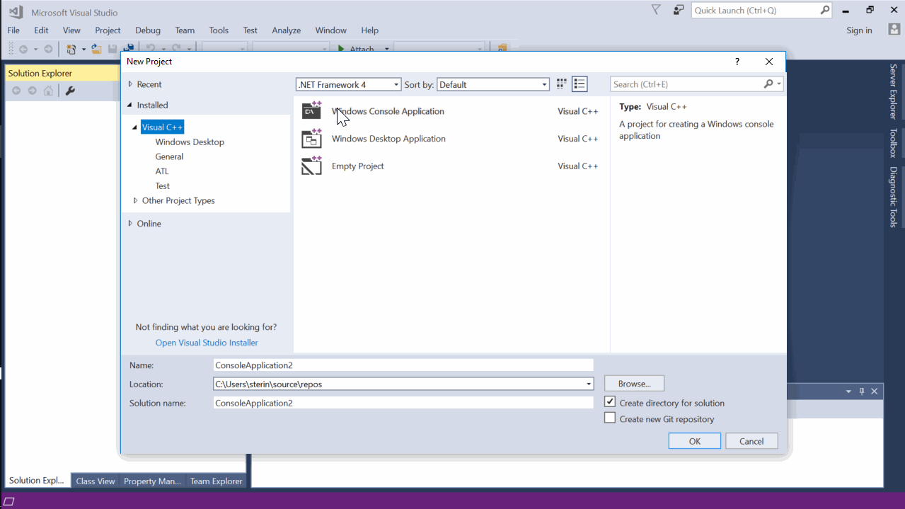
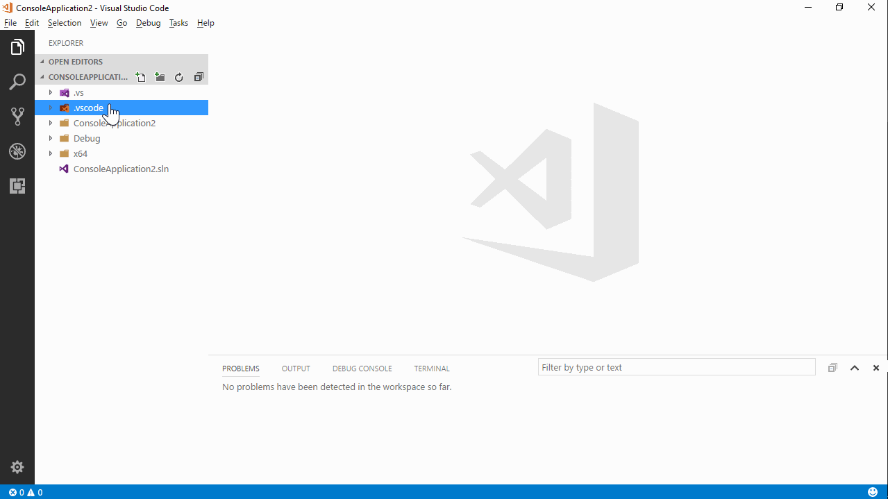

# msbuild-tools

Work with Visual Studio (MSBuild) projects from inside Visual Studio Code.

Feedback is highy appreciated! Let me know if this works for you? Are there any showstopping bugs? Any features missing?

(I should probably merge this is vscode-xbuild-tools when I have time)

## Caveats

* First release, my first non-trivial TypeScript/JavaScript program - expect bugs, problems, and non-idiomatic code.
* Managing the project (adding files, changing settings, etc.) has to be done using Visual Studio itself.

## Features

* Build/Clean/Debug/Run Visual Studio solutions from within vscode.
* Switch between configurations (Debug/Release)
* Debug directly from vscode - easily define debug configuration.
* Status bar items that make it easy to build, debug, switch build and debug configurations.

## Demo

1. Create a project in Visual Studio

2. Open the project in VSCode

## Example

The example subdirectory of this repository contains a working example.

1. Open Visual Studio code in `example/helloworld` and examine the file `.vscode/msbuild-tools.json`.

2. Use `msbuild-tools` command to build, debug, run, clean, switch build configuration, and switch debug configurations.

3. Use the status bar to build, debug, switch configurations or kill the build.

## Credits

* Heavily influenced by the great [CMake-Tools](https://github.com/vector-of-bool/vscode-cmake-tools) extension. 
* Code derived from the basic extension generated by [`yo code`](https://github.com/Microsoft/vscode-generator-code).
